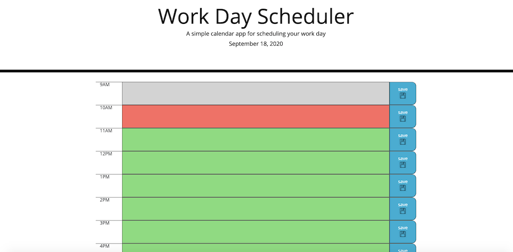
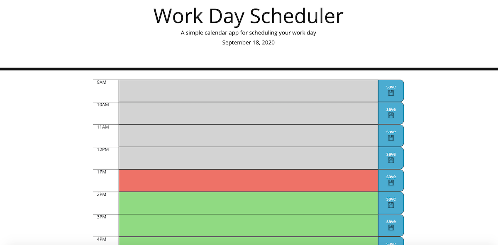
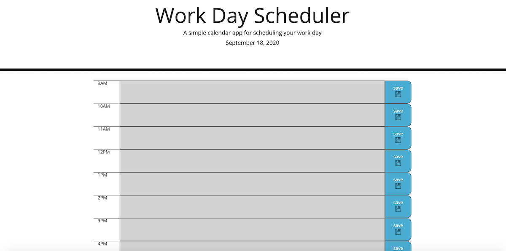

# day-planner website project

## Description 

Many developers frequently utilize APIs in their website apps because these apps are generally very well-coded and are available to use at little to no cost, compared to the large expense of time, effort, and money to develop one from scratch with no guarantee of success.

This project was an introduction to these third-party APIs, a simple calendar application supposed to allow the user to save events for each hour of the day.  This app runs in the browser and uses the Moment.js library to work with date and time.

The two objectives in terms of utilizing Moment.js were 1) to dynamically load the current date in the page header and 2) to compare business-hour-block time slots within the calendar to the actual time of day pulled from Moment.js.

If an hour block of time is in the future, it is colored bright green.  If an hour block of time corresponds with the actual current hour, it is colored bright orange.  If an hour block of time is in the past, it turns gray.

A save button corresponds on each hour of time so that the user can presumably save a task, to-do, appointment, or other event to the local storage on the browser.  If built successfully they can then close the browser or reload the page and still have those tasks populate into the calendar as long as they have not cleared their browser history.

I was able to achieve putting the hour and corresponding to-do into local storage but was not successful in finding a way to retrieve it.  The timing functions using Moment.js were successfully incorporated into the project.

### URL and Screen Shot

The URL for this website is https://7j647.github.io/day-planner/

### Credits

With thanks to Coach Jonathan and his team and to Josh Furlin who greatly assisted in a tudor session.

#### License

Copyright (c) [2020] [Jeff Flynn]

Permission is hereby granted, free of charge, to any person obtaining a copy
of this software and associated documentation files (the "Software"), to deal
in the Software without restriction, including without limitation the rights
to use, copy, modify, merge, publish, distribute, sublicense, and/or sell
copies of the Software, and to permit persons to whom the Software is
furnished to do so, subject to the following conditions:

The above copyright notice and this permission notice shall be included in all
copies or substantial portions of the Software.

THE SOFTWARE IS PROVIDED "AS IS", WITHOUT WARRANTY OF ANY KIND, EXPRESS OR
IMPLIED, INCLUDING BUT NOT LIMITED TO THE WARRANTIES OF MERCHANTABILITY,
FITNESS FOR A PARTICULAR PURPOSE AND NONINFRINGEMENT. IN NO EVENT SHALL THE
AUTHORS OR COPYRIGHT HOLDERS BE LIABLE FOR ANY CLAIM, DAMAGES OR OTHER
LIABILITY, WHETHER IN AN ACTION OF CONTRACT, TORT OR OTHERWISE, ARISING FROM,
OUT OF OR IN CONNECTION WITH THE SOFTWARE OR THE USE OR OTHER DEALINGS IN THE
SOFTWARE.

---

##### Badges

###### Contributing

For other developers who would like to improve the work done on this project or offer suggestions, please feel free to do so and Slack me with your comments.

###### Contact
<jeffreyedwardflynn@gmail.com>